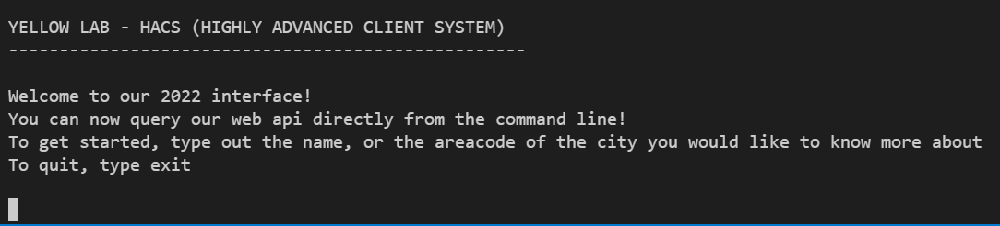

<link href="https://fonts.googleapis.com/css2?family=Material+Icons+Outlined"
      rel="stylesheet">
      
# Yellow Lab PE

Kies uit de volgende uitdagingen. Vergeet niet je proces goed te documenteren! Let op, sommige sluiten elkaar uit:

-  Schrijf een lokale console applicatie die gebruik maakt van de web api. Voeg de console applicatie toe als eigen client aan de identity server met zijn eigen `client_secret`. Via de console applicatie kan je de naam intypen van een gemeente of een postcode. Er zal dan getoond worden hoeveel abonnees die gemeente heeft.

    

-  In de plaats van een eigen identity server maak je liever gebruik van bestaande services zoals Auth0. Maar een account aan op Auth0 en zorg ervoor dat de Client Credentials flow gebruik maakt van Auth0 in de plaats van onze eigen identity server.

-  Voeg een nieuwe service toe. Een eenvoudige MVC Web app (je mag kiezen welke technologie) die een webpagina ter beschikking stelt met een eenvoudige boodscap: `Maarten lust geen spruitjes`. Om deze boodschap te zien moet je eerst inloggen. Dat doe je met behulp van `OpenID` connect. Je mag daarvoor gebruik maken Auth0 of de eigen identity server verder configureren. Zorg ervoor dat de MVC app meedraait in de docker container.

-  Dit is dezelfde opdracht als/een uitbreiding op de vorige. Je maakt voorgaande opdracht. Zorg er nu voor dat er nog een tweede webpagina ter beschikking staat met de eenvoudige boodschap `Security Advanced, het beste vak.` Je voegt authorisatie toe aan de hand van de OAuth `Authorization Code Flow`. Je zorgt dat er 2 verschillende scopes zijn: `basic` en `advanced`. Met de `scope` kan je alle webpagina's zien. Met de `basic` scope kan je enkel de eerste webpagina (`Maarten lust geen spruitjes`) zien.

-  Zorg ervoor dat alle communicatie tussen de services via HTTPS verloopt. Je mag daarvoor developer signed certificates gebruiken maar de services moeten wel blijven draaien binnen docker. Documenteer nauwkeurig!

